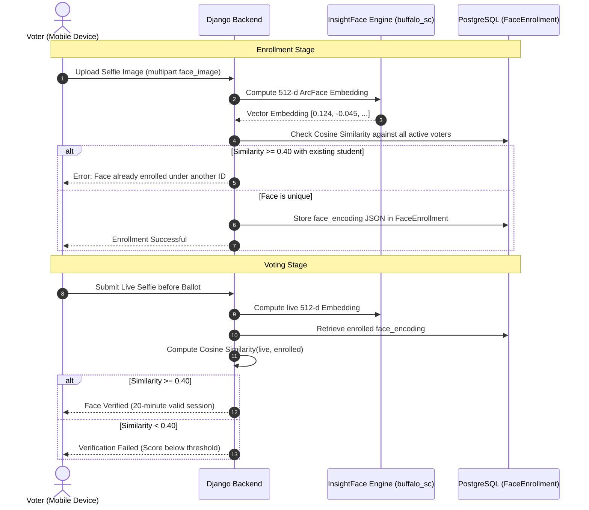

# ELECOM Web & Backend — Secure Election Platform 🗳️

[](https://www.djangoproject.com/)
[](https://www.python.org/)
[](https://www.postgresql.org/)
[](https://github.com/deepinsight/insightface)
[](https://groq.com/)
[](https://nginx.org/)
[](LICENSE)

The official backend REST API service and web administration portal for the **ELECOM** student election platform at **USTP-Oroquieta Campus**. Built with Django, PostgreSQL, local InsightFace biometrics, Groq AI, and vanilla JavaScript/HTML/CSS for the COMELEC administrative board.

> **Audience**: Intended for any AI coding agent or software engineer working in this workspace. Keep this document aligned with `F:\elecom_mobile\AGENTS.md`.

---

## 📖 Table of Contents

- [Overview & Workspace Map](#-overview--workspace-map)
- [System Architecture](#-system-architecture)
- [Key Features](#-key-features)
- [Tech Stack & Dependencies](#-tech-stack--dependencies)
- [Repository & Directory Structure](#-repository--directory-structure)
- [Configuration & Environment Variables (.env)](#-configuration--environment-variables-env)
- [Local Development Setup (Windows)](#-local-development-setup-windows)
- [Production Deployment & Server Operations (Ubuntu)](#-production-deployment--server-operations-ubuntu)
- [Shared Backend & API Contracts](#-shared-backend--api-contracts)
- [Biometric Face Verification (InsightFace)](#-biometric-face-verification-insightface)
- [SMS OTP — TextBee gateway](#sms-otp--textbee-gateway-confirmed-working-2026-10-10)
- [EleVote Live Chat & Admin Support System](#-elevote-live-chat--admin-support-system)
- [Web Admin UI Rules & Design Consistency](#-web-admin-ui-rules--design-consistency)
- [USTP-Oroquieta Omnibus Election Code Context](#-ustp-oroquieta-omnibus-election-code-context)
- [Quality Gates & Testing](#-quality-gates--testing)
- [Engineering Conventions & Git Hygiene](#-engineering-conventions--git-hygiene)
- [Troubleshooting & Common Failure Scenarios](#-troubleshooting--common-failure-scenarios)

---

## 🗺️ Overview & Workspace Map

The complete ELECOM voting solution consists of two primary project directories:

```
F:\
├── elecom_web\                # [THIS REPO] Django API backend & Static Admin Web Frontend
│   ├── backend\               # Django project (manage.py, settings, views, migrations)
│   └── frontend\              # Admin web portal HTML/CSS/JS assets
│
└── elecom_mobile\             # [SEPARATE REPO] Flutter Client (iOS & Android)
    ├── lib\                   # Flutter app entrypoint, features, and core config
    └── assets\                # App images, logos, and Lottie animations
```

### Responsibility Boundaries

- **Django Backend (`F:\elecom_web\backend`)**: The sole source of truth for database records, election states, candidate rosters, votes, SHA-256 ledger integrity, biometric embeddings, OTP delivery, user profiles, and audit logs.
- **Admin Web Frontend (`F:\elecom_web\frontend\org_elecom\elecom_admin`)**: Static administrative interface for COMELEC officers (elections management, candidate registration, canvassing, reports, network whitelist, and live chat support).
- **Mobile Client (`F:\elecom_mobile`)**: Flutter client consuming `{API_BASE_URL}/api/mobile/...` endpoints for authentication, voting, receipt verification, and voter support chat.

> **Rule for Agents**: Any task addressing 404/500 API errors, database schemas, OTP/email delivery, live chat backend logic, or election lifecycle rules must be executed in `F:\elecom_web\backend`, not in `elecom_mobile`.

---

## 🏛️ System Architecture

```mermaid
flowchart TD
    subgraph Clients [Clients & Interfaces]
        MobileApp["Flutter Mobile App (iOS / Android)"]
        AdminWeb["COMELEC Admin Web Portal (Desktop)"]
        VoterWeb["Voter Web Interface"]
    end

    subgraph EdgeLayer [Edge & Networking]
        DNS["DuckDNS (el3com.duckdns.org)"]
        Nginx["Nginx Reverse Proxy (Ports 80 -> 443 SSL)"]
        Certbot["Let's Encrypt Auto-Renewal"]
    end

    subgraph BackendCore [Django Backend (Gunicorn 127.0.0.1:8000)]
        DjangoCore["Django 6.0 + REST Framework"]
        WhiteNoise["WhiteNoise Middleware (Static Files)"]
        CoreApp["core (Views, Auth, Admin APIs, Router)"]
        VotingApp["elecom_voting (Elections, Ballots, Ledger)"]
        FaceService["local_face_service.py (InsightFace ArcFace 512-d)"]
    end

    subgraph DataIntegrations [Data Stores & External Gateways]
        Postgres[("PostgreSQL Database (elecom_db)")]
        Cloudinary["Cloudinary (Candidate Photos & Logos)"]
        GroqCloud["Groq Cloud AI (EleVote Llama 3)"]
        SMSChefGateway["TextBee Gateway (Realme RMX3261 Phone)"]
    end

    MobileApp -->|HTTPS / REST API| DNS
    AdminWeb -->|HTTPS / Static & REST| DNS
    VoterWeb -->|HTTPS / Static & REST| DNS
    DNS --> Nginx
    Certbot -.-> Nginx
    Nginx -->|proxy_pass| DjangoCore
    DjangoCore --> WhiteNoise
    DjangoCore --> CoreApp
    DjangoCore --> VotingApp
    DjangoCore --> FaceService
    CoreApp --> Postgres
    VotingApp --> Postgres
    CoreApp --> Cloudinary
    CoreApp --> GroqCloud
    CoreApp --> SMSChefGateway
```

---

## 🌟 Key Features

- **Secure Authentication & RBAC**: Session-based authentication for COMELEC admin officers and JWT / token authentication for students and voters.
- **USTP-Oroquieta Election Code Compliance**: Enforces voter eligibility, candidate qualification, election timelines, non-partisan balloting, and tie-breaking protocols.
- **Biometric Voter Verification (Local InsightFace)**: 512-dimensional ArcFace facial embeddings with ONNX Runtime. Ensures 1-student-1-face registration and live face verification before voting with zero external API fees.
- **Hardware-Relayed SMS OTP**: Automated verification code dispatch via TextBee running on a dedicated Android phone gateway (Realme RMX3261).
- **EleVote AI Live Chat & Admin Takeover**: Groq-powered AI support assistant that answers election guidelines instantly, with real-time COMELEC officer takeover and thread management.
- **Campus Network Authorization**: Enforces voting exclusively from designated USTP campus Wi-Fi networks using LAN IP prefix and subnet filtering.
- **Tamper-Evident SHA-256 Vote Ledger**: Cryptographic chaining of cast votes ensuring election immutability and verifiable vote receipts.
- **Dynamic Canvassing & PDF Reporting**: Instant real-time vote tabulations supporting current and historical election scopes, with printable PDF proclamation reports.
- **Database Backup, Restore & Protected Reset**: One-click database backups and password-gated vote reset functionality for test cycle purges.

---

## 🛠️ Tech Stack & Dependencies

| Layer | Technology | Details |
|---|---|---|
| **Language** | Python 3.10+ | Strict type hints where possible |
| **Framework** | Django 6.0+ & DRF 3.18+ | REST APIs, Session Auth, Form Handling |
| **Database** | PostgreSQL 14+ | `psycopg2-binary`, BIGSERIAL primary keys |
| **WSGI Server** | Gunicorn 20.1+ | Bound to `127.0.0.1:8000`, 3 workers |
| **Reverse Proxy** | Nginx | Port 80 HTTP -> 443 HTTPS redirect |
| **SSL / TLS** | Let's Encrypt Certbot | Domain: `el3com.duckdns.org` |
| **Static Delivery** | WhiteNoise 6.0+ | `CompressedManifestStaticFilesStorage` |
| **Biometrics** | InsightFace + ONNX Runtime + OpenCV | ArcFace model (`buffalo_sc`), `libgl1` required |
| **AI Assistant** | Groq Python SDK 0.9+ | Fast LLM inference for voter questions |
| **Image Hosting** | Cloudinary SDK 1.36+ | Candidate portraits, party logos, verification snapshots |
| **SMS Relay** | TextBee REST Gateway | Direct Android SIM relay to Philippine carriers |
| **Cryptography** | bcrypt 4.0+ | Password hashing for voter import |
| **Frontend** | Vanilla JS, HTML5, CSS3 | No compilation needed; query versioning `?v=` |

---

## 📁 Repository & Directory Structure

```
F:\elecom_web\
├── AGENTS.md                                # [This Guide] Comprehensive agent instructions
├── README.md                                # High-level project summary
├── .gitignore                               # Git exclusions (.env, pycache, static builds)
│
├── backend\                                 # Django Web & API Core
│   ├── manage.py                            # Django management script
│   ├── requirements.txt                     # Python pip dependencies
│   ├── .env                                 # Secrets & environment config (NEVER COMMIT)
│   ├── core\                               # Core project configuration
│   │   ├── __init__.py
│   │   ├── settings.py                      # Django settings (DB, Cloudinary, Apps, Middleware)
│   │   ├── urls.py                          # Global URL router (Mobile & Admin APIs)
│   │   ├── views.py                         # Primary views, authentication, APIs & admin handlers
│   │   ├── wsgi.py                          # Gunicorn WSGI entrypoint
│   │   ├── asgi.py                          # ASGI stub
│   │   ├── local_face_service.py            # Local InsightFace ArcFace biometric engine
│   │   └── facepp_service.py                # Legacy Face++ fallback service
│   ├── elecom_auth\                         # Authentication & user profile module
│   │   ├── models.py                        # User, Profile, and Role models
│   │   ├── views.py                         # Auth endpoints
│   │   └── migrations\                     # Django schema migrations
│   ├── elecom_voting\                       # Voting, elections, and candidate module
│   │   ├── models.py                        # Elections, Candidates, Votes, Ledger models
│   │   ├── views.py                         # Voting logic & tallying views
│   │   └── migrations\                     # Django schema migrations
│   ├── db\                                 # Database utilities and schema scripts
│   └── backup\                             # Local SQL backup dumps
│
└── frontend\                                # Web Admin & Static Assets
    ├── assets\                             # Shared branding, images, and Lottie animations
    └── org_elecom\
        └── elecom_admin\                   # COMELEC Administration Portal
            ├── admin_dashboard.html         # Main dashboard overview
            ├── elecom_elections.html        # Election creation and lifecycle
            ├── elecom_election_date.html    # Voting period & date range scheduler
            ├── elecom_candidates.html       # Candidate listing and status
            ├── elecom_register_candidate.html # Candidate filing form
            ├── elecom_voters.html           # Voter list and batch CSV/Excel import
            ├── elecom_results.html          # Live canvassing & results preview
            ├── elecom_reports.html          # Proclamation & audit report exporter
            ├── elecom_transparency.html     # Cryptographic vote ledger inspection
            ├── elecom_live_chat.html        # Admin support inbox & human takeover
            ├── elecom_network_authorize.html # Campus Wi-Fi IP/subnet whitelist
            ├── elecom_backup_restore.html   # DB backup management
            ├── elecom_reset.html            # Protected test data purge
            ├── profile.html                 # Officer profile management
            ├── search_results.html          # Global voter/candidate search
            └── admin_components\            # Reusable admin styles and scripts
                ├── admin_css\
                │   ├── admin_dashboard.css  # Core design system & navy sidebar styles
                │   └── elecom_reports.css   # Report print and export styling
                └── admin_js\
                    ├── admin_user_menu.js   # Shared header, notifications bell & reset gate
                    ├── elecom_live_chat.js  # Live chat polling and takeover controller
                    └── elecom_reports.js    # Canvas/PDF export engine
```

---

## ⚙️ Configuration & Environment Variables (.env)

The backend loads configuration from `F:\elecom_web\backend\.env` locally and `/var/www/elecom/backend/.env` in production.

| Variable Name | Required | Default / Example | Purpose |
|---|:---:|---|---|
| `DEBUG` | Yes | `True` (local), `False` (prod) | Django debug mode |
| `SECRET_KEY` | Yes | `django-insecure-...` | Django security cryptographic salt |
| `DJANGO_ALLOWED_HOSTS` | No | `el3com.duckdns.org,127.0.0.1` | Comma-separated allowed hostnames |
| `DB_NAME` | Yes | `elecom_db` | PostgreSQL database name |
| `DB_USER` | Yes | `postgres` (local) / `elecom_backend` | PostgreSQL username |
| `DB_PASSWORD` | Yes | Local password or socket peer auth | PostgreSQL user password |
| `DB_HOST` | Yes | `localhost` or `127.0.0.1` | PostgreSQL host |
| `DB_PORT` | Yes | `5432` | PostgreSQL port |
| `CLOUDINARY_CLOUD_NAME`| Yes | `your_cloud_name` | Cloudinary storage bucket |
| `CLOUDINARY_API_KEY` | Yes | `your_api_key` | Cloudinary API access key |
| `CLOUDINARY_API_SECRET`| Yes | `your_api_secret` | Cloudinary API secret |
| `GROQ_API_KEY` | Yes | `gsk_...` | Groq AI API key for EleVote chat |
| `GROQ_MODEL` | No | `llama3-70b-8192` | Model identifier for EleVote responses |
| `SMS_PROVIDER` | Yes | `textbee` | Current SMS gateway selection |
| `TEXTBEE_API_KEY` | Yes | Private key | TextBee authentication |
| `TEXTBEE_DEVICE_ID` | Yes | Registered device ID | TextBee Android gateway |
| `TEXTBEE_SIM_SUBSCRIPTION_ID` | No | Blank | Use the app default TM SIM |
| `SMSCHEF_API_KEY` | No | Legacy private key | Explicit rollback only |
| `SMSCHEF_DEVICE_ID` | No | Legacy device ID | Explicit rollback only |
| `SMSCHEF_SIM_SLOT` | No | Legacy provider setting | Verify SMS Chef API mapping before rollback; not an Android subscription ID |
| `EMAIL_BACKEND` | Yes | `django.core.mail.backends.smtp.EmailBackend` | Mail backend (console for testing) |
| `EMAIL_HOST` | Yes | `smtp.gmail.com` | SMTP relay server |
| `EMAIL_PORT` | Yes | `587` | SMTP port |
| `EMAIL_USE_TLS` | Yes | `True` | Enable TLS for SMTP |
| `EMAIL_HOST_USER` | Yes | `it.elecom.ustp@gmail.com` | System sender email address |
| `EMAIL_HOST_PASSWORD` | Yes | 16-character Google App Password | SMTP credential |
| `DEFAULT_FROM_EMAIL` | Yes | `ELECOM <it.elecom.ustp@gmail.com>` | Display sender name and email |
| `FACE_VOTE_VERIFY_SESSION_MINUTES` | No | `20` | Face verification validity window |
| `FACEPP_API_KEY` | No | Fallback key | Legacy Face++ API key (if needed) |
| `FACEPP_API_SECRET` | No | Fallback secret | Legacy Face++ API secret |

---

## 💻 Local Development Setup (Windows)

### Prerequisites

- **Python 3.10+** (verified with Python 3.13)
- **PostgreSQL 14+** installed with pgAdmin
- **Git for Windows**

### Setup Steps

1. **Navigate to the backend directory**:
   ```powershell
   cd F:\elecom_web\backend
   ```

2. **Create and activate a virtual environment**:
   ```powershell
   python -m venv venv
   .\venv\Scripts\Activate.ps1
   ```

3. **Install dependencies**:
   ```powershell
   pip install --upgrade pip
   pip install -r requirements.txt
   ```

4. **Configure Local PostgreSQL**:
   Open pgAdmin or run `psql -U postgres`:
   ```sql
   CREATE DATABASE elecom_db;
   ```
   Ensure your `backend\.env` reflects your local postgres credentials:
   ```env
   DEBUG=True
   DB_NAME=elecom_db
   DB_USER=postgres
   DB_PASSWORD=your_local_password
   DB_HOST=localhost
   DB_PORT=5432
   ```

5. **Run database migrations**:
   ```powershell
   python manage.py migrate
   ```

6. **Create an initial administrative account**:
   ```powershell
   python manage.py createsuperuser
   ```
   *(Or insert COMELEC admin student record directly in pgAdmin)*

7. **Launch the development server**:
   ```powershell
   python manage.py runserver 0.0.0.0:8000
   ```

### Connecting the Flutter App to Local Backend

When testing the mobile client against your local Windows PC:
- Bind Django to `0.0.0.0:8000` (not `127.0.0.1`).
- Find your local IPv4 address via `ipconfig` (e.g., `192.168.1.171`).
- Verify Windows Defender Firewall allows incoming connections on port 8000.
- Run the Flutter app with:
  ```powershell
  cd F:\elecom_mobile
  flutter run --dart-define=API_BASE_URL=http://192.168.1.171:8000
  ```

---

## 🚀 Production Deployment & Server Operations (Ubuntu)

The live production backend runs on a **Kamatera Ubuntu Linux VPS**.

- **Public HTTPS Domain**: `https://el3com.duckdns.org`
- **Application Directory**: `/var/www/elecom/backend`
- **Virtual Environment**: `/var/www/elecom/venv`
- **Static Files Directory**: `/var/www/elecom_static`
- **Gunicorn Systemd Service**: `gunicorn` (`/etc/systemd/system/gunicorn.service`)
- **Nginx Configuration**: `/etc/nginx/sites-available/elecom`

> **CRITICAL**: Do **NOT** deploy or pull code inside `~/elecom_web`. The live web server is exclusively served from `/var/www/elecom`.

### Standard Deploy Workflow

After committing and pushing changes to GitHub:

```bash
# 1. Connect to the VPS and enter the live repository
cd /var/www/elecom
git pull origin main

# 2. Collect static files for WhiteNoise and Nginx
/var/www/elecom/venv/bin/python backend/manage.py collectstatic --noinput

# 3. Apply any pending database migrations
/var/www/elecom/venv/bin/python backend/manage.py migrate

# 4. Restart Gunicorn app workers
sudo systemctl restart gunicorn

# 5. Verify service health
sudo systemctl status gunicorn --no-pager | tail -10
```

### Fresh Server Bootstrap Checklist

If setting up a new server or recovering from a wipe:

1. **Install System Dependencies (including OpenGL for OpenCV)**:
   ```bash
   sudo apt-get update
   sudo apt-get install -y python3-venv python3-pip postgresql nginx certbot python3-certbot-nginx libgl1
   ```

2. **Clone Repository & Setup Virtual Environment**:
   ```bash
   sudo git clone https://github.com/your-org/elecom_web.git /var/www/elecom
   sudo chown -R $USER:$USER /var/www/elecom
   python3 -m venv /var/www/elecom/venv
   /var/www/elecom/venv/bin/pip install --upgrade pip
   /var/www/elecom/venv/bin/pip install -r /var/www/elecom/backend/requirements.txt
   ```

3. **Create Production `.env` File (`/var/www/elecom/backend/.env`)**:
   Populate with production Cloudinary, Groq, TextBee, and Email credentials.

4. **Initialize Database Schema & Admin**:
   ```bash
   /var/www/elecom/venv/bin/python /var/www/elecom/backend/manage.py migrate

   # Insert default COMELEC administrator user
   sudo -u postgres psql -d elecom_db -c "
   INSERT INTO users (id, student_id, password_hash, created_at, role, department, position, phone, email, terms_accepted_at)
   VALUES (1, '2023304637', '2023304637', NOW(), 'admin', 'BSIT', '', '09308288544', 'rpsvcodes@gmail.com', NOW())
   ON CONFLICT (id) DO NOTHING;"
   ```

5. **Configure Gunicorn Systemd Unit (`/etc/systemd/system/gunicorn.service`)**:
   ```ini
   [Unit]
   Description=Gunicorn daemon for ELECOM Voting Backend
   After=network.target

   [Service]
   User=root
   Group=www-data
   WorkingDirectory=/var/www/elecom/backend
   ExecStart=/var/www/elecom/venv/bin/gunicorn \
             --access-logfile - \
             --error-logfile - \
             --workers 3 \
             --timeout 120 \
             --bind 127.0.0.1:8000 \
             core.wsgi:application
   Restart=on-failure
   RestartSec=5s

   [Install]
   WantedBy=multi-user.target
   ```
   *Note: Gunicorn strictly binds to `127.0.0.1:8000`. Never expose `0.0.0.0:8000` directly in production.*

6. **Configure Nginx Site (`/etc/nginx/sites-available/elecom`)**:
   ```nginx
   server {
       server_name el3com.duckdns.org;

       location /static/ {
           alias /var/www/elecom_static/;
           expires 30d;
           add_header Cache-Control "public, max-age=2592000";
       }

       location / {
           proxy_pass http://127.0.0.1:8000;
           proxy_set_header Host $host;
           proxy_set_header X-Real-IP $remote_addr;
           proxy_set_header X-Forwarded-For $proxy_add_x_forwarded_for;
           proxy_set_header X-Forwarded-Proto $scheme;
       }
   }
   ```

7. **Issue Let's Encrypt SSL Certificate**:
   ```bash
   sudo certbot --nginx -d el3com.duckdns.org
   ```

---

## 📡 Shared Backend & API Contracts

### General Rules

- **Source of Truth**: The Django database is the single authority for elections, candidates, cast votes, audit records, and live chat threads.
- **Consistent JSON Shape**: All mobile and admin JSON endpoints return an `ok` boolean flag:
  - Success: `{"ok": true, "data": ...}`
  - Error: `{"ok": false, "error": "Human readable explanation"}`
- **PostgreSQL-Safe SQL**: Never use SQLite syntax like `AUTOINCREMENT`. Use Django ORM or PostgreSQL DDL (`BIGSERIAL`, `ON CONFLICT DO NOTHING`).
- **Election Scoping**: Always respect `election_id`. Archival views must not inadvertently hide past election cycles when requested.

### Key Mobile Endpoints (`/api/mobile/...`)

| HTTP Method | Route | Description |
|---|---|---|
| `POST` | `/api/mobile/auth/login/` | Voter credentials verification & token generation |
| `POST` | `/api/mobile/auth/forgot-password/` | Initiates OTP dispatch (returns 404 if Student ID not found) |
| `POST` | `/api/mobile/auth/verify-otp/` | Validates 6-digit SMS/Email OTP code |
| `POST` | `/api/mobile/auth/reset-password/` | Commits new voter account password |
| `GET` | `/api/mobile/election/current/` | Active election details, positions, and timeline |
| `GET` | `/api/mobile/ballot/` | Eligible candidates list for voter's department/course |
| `POST` | `/api/mobile/face/verify/` | Live selfie comparison before ballot unlock |
| `POST` | `/api/mobile/vote/submit/` | Cryptographic vote submission & block ledger generation |
| `GET` | `/api/mobile/vote/receipt/` | Verifiable digital vote receipt with SHA-256 hash |
| `GET/POST`| `/api/mobile/elevote/chat/` | Voter messaging to EleVote AI & live support thread |
| `GET` | `/api/mobile/network/check/` | Pre-flight check verifying student device is on campus Wi-Fi |

### Key Admin Endpoints (`/api/admin/...`)

| HTTP Method | Route | Description |
|---|---|---|
| `GET` | `/api/admin/dashboard/` | Real-time turnout, candidate vote distribution, and metrics |
| `POST` | `/api/admin/elections/create/` | Register new academic election cycle |
| `POST` | `/api/admin/candidates/register/` | Register verified candidate with Cloudinary photo upload |
| `POST` | `/api/admin/voters/import/` | Batch import student voters from CSV/Excel (hashes via bcrypt) |
| `GET` | `/api/admin/chat/conversations/` | List all voter chat threads, unread status, and takeover state |
| `GET` | `/api/admin/chat/thread/` | Fetch full conversation history for a given student ID |
| `POST` | `/api/admin/chat/reply/` | Send COMELEC officer reply into voter thread |
| `POST` | `/api/admin/chat/takeover/` | Toggle human officer takeover (suppresses AI responses) |
| `POST` | `/api/admin/network-settings/` | Update authorized campus IP subnets and ranges |
| `POST` | `/api/admin/reset/` | Protected test vote purge (requires admin password verification) |

---

## 👤 Biometric Face Verification (InsightFace)

To avoid external API costs and eliminate quota limits (`CONCURRENCY_LIMIT_EXCEEDED` on Face++), ELECOM uses a **local InsightFace (ArcFace)** deep-learning engine.

### How it Works



### Technical Implementation

- **Model**: `buffalo_sc` (ArcFace 512-dimensional embedding via ONNX Runtime).
- **Core File**: `backend/core/local_face_service.py`.
- **Database Column**: `FaceEnrollment.face_encoding` (TextField containing JSON serialized vector).
- **Match Threshold**: `cosine_similarity >= 0.40`.
- **System Requirements**: Requires `libgl1` on Linux (`apt-get install -y libgl1`).
- **First Run Behavior**: On initial execution, InsightFace downloads the ~30MB model weights into `~/.insightface/models/`.

---

## SMS OTP — TextBee gateway (confirmed working 2026-10-10)

TextBee is the current SMS provider. SMS Chef is retained only for explicit rollback;
do not restart diagnosis by switching SIM indexes or returning to SMS Chef.

### Ownership and configuration

- Flutter requests OTP through `POST /api/mobile/auth/forgot-password/` with `method: "sms"`. Django owns SMS dispatch; never put gateway credentials in Flutter.
- Backend source: `F:\elecom_web\backend`. Production: `/var/www/elecom/backend`. Local and server `.env` files are separate; Git does not deploy `.env`.
- `_send_otp_sms` in `backend/core/views.py` selects `SMS_PROVIDER`. TextBee dispatch is in `backend/core/textbee_sms.py`; configuration is in `backend/core/settings.py`; tests are in `backend/core/test_textbee_sms.py`.
- Configure the server with the following (never document actual API keys):

```dotenv
SMS_PROVIDER=textbee
TEXTBEE_API_KEY=<private TextBee key>
TEXTBEE_DEVICE_ID=<registered TextBee device ID>
TEXTBEE_SIM_SUBSCRIPTION_ID=
```

- Known gateway: Realme RMX3261. The TextBee device ID is different from the old SMS Chef device ID; copy it from TextBee, never reuse the SMS Chef ID.
- In the TextBee Android app: Gateway Enabled ON; Default SIM **TM (SIM 2), Android subscription ID 2**. TNT is subscription ID 1. TM has the user's active text plan; earlier failed attempts used TNT.
- Leave `TEXTBEE_SIM_SUBSCRIPTION_ID` **blank** for this deployment. The backend omits `simSubscriptionId`, matching successful website sends and using the app's TM default. An explicit override is supported if deliberately required elsewhere.
- Android subscription IDs are not SIM slot indexes and can change after SIM swaps. Never infer provider numbering from Android slot indexes. Older SMS Chef 0/1 instructions were inconsistent and must not be reused as facts.
- Grant SMS/phone permissions, keep gateway internet connected, and allow background operation. A gateway enabled flag does not prove current connectivity; inspect heartbeat and message timestamps. Current configured send delay was 5 seconds.
- TextBee's free plan screenshot showed 50 daily / 300 monthly usage limits; verify current plan before relying on those values. Unused quota was available during this incident; upgrading was not needed.

### Verified API and message behavior

- POST `https://api.textbee.dev/api/v1/gateway/send-sms`, JSON body with `deviceId`, `recipients: ["+639XXXXXXXXX"]`, and `message`. Optional `simSubscriptionId` must be numeric if present.
- Headers: `x-api-key`, `Content-Type: application/json`, `Accept: application/json`, and **`User-Agent: ELECOM-Backend/1.0`**.
- Python urllib's default User-Agent produced HTTP 403. A read-only `/gateway/stats` comparison using the same key returned 403 with the default identity and 200 with the explicit ELECOM identity. Preserve the explicit User-Agent; do not diagnose every 403 as an invalid key.
- Philippine recipient normalization: `09XXXXXXXXX`, `9XXXXXXXXX`, or `639XXXXXXXXX` becomes `+639XXXXXXXXX`. A website test using `639...` without `+` failed; local `09...` and `+639...` worked. Keep the plus sign.
- **Current successful OTP text:** `ELECOM code: {otp}. Valid for {expiry_minutes} minutes. Do not share.` Keep the code and actual expiry in the message; preserve leading zeroes in OTP strings.
- The previous `Your ELECOM OTP is: ... Valid for ... Do not share this code.` repeatedly failed to appear on the target phone even when TextBee marked it delivered. A user-authorized API test (`ELECOM test code: 123456. This is a delivery test.`) arrived. After shortening the real OTP message and deploying it, the user confirmed **it works**.
- Content-dependent delivery/filtering is plausible, but the exact carrier/handset cause was **not proven**. Do not claim a specific spam filter or carrier rule was established. Preserve the working wording unless a controlled test justifies a change.
- Manual success alone does not establish the API failure's cause. Compare the same recipient, sender SIM, exact message text, and actual inbox receipt; a short generic manual test differs from an OTP.

### Status interpretation and diagnostics

- Require JSON `data.success == true` and a non-empty `data.smsBatchId` before accepting the queue request. No automatic SMS resend/fallback: it can create duplicates and invalidate older codes.
- API acceptance means **queued**, not received. `dispatched` means pushed toward the gateway, not an Android send attempt. `sent` means carrier acceptance; `delivered` is the provider's carrier delivery report, not proof the user saw the message. The incident included delivered reports without visible inbox messages.
- Read-only endpoints: `GET /gateway/stats`, `/gateway/devices/{deviceId}`, `/gateway/messages`, and `/gateway/devices/{deviceId}/sms-batch/{smsBatchId}` under the same API base.
- Compare `requestedAt`, `dispatchedAt`, `pushReceivedAt`, `sendAttemptedAt`, `sentAt`, `deliveredAt`, `errorCode`, and gateway `lastHeartbeat`. Convert UTC to Asia/Singapore/Philippine time (UTC+8). Do not invent a delay from screenshots or mix different OTP attempts.
- One authorized test stalled at `dispatched` with no phone acknowledgement and a heartbeat about 17 minutes old; the user subsequently confirmed receipt. This is evidence of intermittent gateway availability, not proof it caused all earlier missing OTPs.
- Logs: `TextBee OTP queued | sim_subscription=default | batch_id=...`; rejection logs include HTTP status. Use `journalctl -u gunicorn --since "5 minutes ago" --no-pager | grep -i textbee` after a fresh request.
- Read-only ADB inbox checks can distinguish Android receipt from Messages display; inspect only metadata or sanitized classification. Never print SMS bodies, OTPs, full recipient numbers, or API credentials into tool output.
- Ask explicit permission before tools send any test SMS; use exactly the authorized recipient/count/content. Read-only status checks do not send messages. Do not silently resend a test because it is still pending.
- Resend generates a new code and supersedes the prior code. Tell the user to use the newest code; delayed older SMS may arrive later.
- Credentials were exposed in screenshots. Never copy their values into source, AGENTS.md, patches, or commits. Rotate exposed keys privately.

### Deployment lessons

- Backend-only changes need deployment and Gunicorn restart; no APK rebuild or database migration is required for this provider/message change. `systemctl is-active` returning `active` proves process health, not delivery.
- Run terminal commands **one at a time**. Pasted commands repeatedly merged with shell prompts. In nano, `*` means unsaved: Ctrl+O, Enter, Ctrl+X.
- After backend changes are committed and pushed, run on the server:

```bash
cd /var/www/elecom
git pull origin main
sudo systemctl restart gunicorn
sudo systemctl is-active gunicorn
```

- A local patch is not automatically on the server. Upload with `scp` from Windows, then `git apply --check` and `git apply` on the server. Apply a patch **once**. If the committed Git pull already contains it, skip patch application. Reapplying a successful patch produces `patch does not apply`.
- If a server patch blocks a Git pull, preserve only the changed gateway files with `git stash push -m "TextBee server patch backup" -- backend/core/textbee_sms.py backend/core/test_textbee_sms.py`, then pull. Do not restore the stash over equivalent committed fixes or discard unrelated work. `.env` is untouched by that scoped stash.
- After SSH disconnects, a prompt such as `F:\elecom_web>` is Windows, not the server. Reconnect before running Linux deployment commands.
- Confirm deployed wording with `grep -n 'ELECOM code:' /var/www/elecom/backend/core/textbee_sms.py`, then request one fresh OTP and verify actual target-phone receipt.

### Validation and references

- Focused tests: from `F:\elecom_web\backend`, run `.\venv\Scripts\python.exe -m unittest core.test_textbee_sms`. Six tests passed during this work, including explicit/default SIM payload, normalization, ASCII single-segment message, queue confirmation, config errors, and no retry on failure. Check current test count/output; this is a historical snapshot.
- Local `manage.py check` was blocked by missing `numpy` imported by the face service, not a TextBee test failure. Do not report full Django checks as passed.
- Setup document: `F:\elecom_web\docs\textbee-otp.md`.
- Official API: https://textbee.dev/docs/sending-sms/sending-sms
- SIM IDs: https://textbee.dev/docs/sending-sms/choosing-a-sim
- Delivery states: https://textbee.dev/docs/sending-sms/delivery-status

---

## 💬 EleVote Live Chat & Admin Support System

The support system combines automated Groq AI customer support with a human COMELEC officer takeover workflow.

### Polling Architecture (WSGI Compatible)

Because Gunicorn operates via synchronous WSGI without Django Channels / WebSockets, real-time messaging is achieved via **low-overhead de-duplicated HTTP polling**:
- **Mobile Polling**: Polls every **3 seconds** (`GET /api/mobile/elevote/chat/?since_id=<last_id>`).
- **Admin Thread Polling**: Polls active student thread every **4 seconds**.
- **Admin Inbox Polling**: Polls conversation list every **8 seconds**.

### Database Models

```sql
-- Message ledger
CREATE TABLE elevote_chat_messages (
    id BIGSERIAL PRIMARY KEY,
    student_id VARCHAR(64) NOT NULL,
    role VARCHAR(16) NOT NULL,          -- 'user' | 'assistant' | 'admin'
    content TEXT NOT NULL,
    model VARCHAR(128) NULL,            -- Groq model name, or admin student_id
    created_at TIMESTAMP WITH TIME ZONE DEFAULT CURRENT_TIMESTAMP
);

-- Admin takeover status
CREATE TABLE elevote_chat_takeover (
    student_id VARCHAR(64) PRIMARY KEY,
    active BOOLEAN NOT NULL DEFAULT TRUE,
    taken_at TIMESTAMP WITH TIME ZONE DEFAULT CURRENT_TIMESTAMP,
    taken_by VARCHAR(64) NULL           -- Admin student ID who took over
);
```

### Takeover Flow

1. **AI Mode (Default)**: Student sends message -> Groq AI generates reply instantly.
2. **Takeover Initiated**: COMELEC officer clicks **"Take Over"** in `elecom_live_chat.html`.
3. **AI Suppression**: Backend sets `elevote_chat_takeover.active = TRUE`. Future voter messages are saved without triggering Groq.
4. **Officer Reply**: Admin types response -> dispatches via `POST /api/admin/chat/reply/` with `role='admin'`.
5. **Release**: Admin clicks **"Release to EleVote"** -> AI auto-replies resume.

### Frontend UI & CSS Rules

- **Bubble Wrapping**: `.chat-bubble-inner` must use `width: fit-content; max-width: 75%;` to ensure short messages like "Yes" do not stretch to the width of the timestamp label.
- **Admin Avatar**: Sender bubbles have no avatar (matches mobile messaging style).
- **Lottie Robot Avatar**: Uses `Robot-Bot 3D.json` via CDN. **Never add an `integrity=` SRI hash** to the CDN script tag as variations will block the script and break rendering.

---

## 🎨 Web Admin UI Rules & Design Consistency

### Sidebar Consistency Rule

All 17 admin HTML pages share a uniform dark navy sidebar. The link order must **strictly** be:

```
Dashboard -> Elections -> Election Dates -> Candidates -> Register Candidate -> Voters -> Results -> Reports -> Transparency -> Live Chat -> Network Authorize -> Backup & Restore
```

> **Live Chat must always appear before Network Authorize.**

### Cache Busting Rule

When editing shared administrative stylesheets or scripts, **always bump the query version string** across all referencing HTML templates:
- `admin_dashboard.css?v=20261006`
- `admin_user_menu.js?v=20261006`
- `elecom_live_chat.js?v=20261006`

### Protected Reset Shortcut

- The **Reset Votes** item is intentionally hidden from the main sidebar.
- It is triggered via a small discreet control in the header navigation next to the notification bell.
- Clicking the control opens a password confirmation modal (`admin_user_menu.js`). Only after verifying the admin password does it navigate to `elecom_reset.html`.

---

## 📜 USTP-Oroquieta Omnibus Election Code Context

ELECOM is the official digital realization of the **USTP-Oroquieta Omnibus Election Code** prepared by the Commission on Elections (COMELEC) and approved by the Supreme Student Council (SSC).

- **Governance (Article II)**: The COMELEC consists of a Chairperson, 5 Deputy Commissioners, and the Director of Student Affairs (ex-officio).
- **Voter Qualifications (Article V)**: Officially enrolled USTP undergraduate students who are SSC members not currently under suspension.
- **Candidate Qualifications (Articles III-IV)**: Requires Certificate of Good Moral Character, 2x2 ID photo, and minimum of 5 candidates for recognized political parties.
- **Voting Window (Article XI)**: Digital elections run for two consecutive days (8:00 AM to 5:00 PM without noon recess). Time gating is enforced by the election window API.
- **Canvassing & Ties (Article XII)**: Votes count automatically upon poll closure. Ties are resolved by a manual public **drawing of lots**; the system highlights ties but never auto-resolves them.

---

## ✅ Quality Gates & Testing

Before submitting code changes, verify all quality gates pass:

### Backend Checks
```powershell
cd F:\elecom_web\backend
.\venv\Scripts\Activate.ps1
python manage.py check
```

### Static Admin Script Syntax Checks
```powershell
node --check F:\elecom_web\frontend\org_elecom\elecom_admin\admin_components\admin_js\admin_user_menu.js
node --check F:\elecom_web\frontend\org_elecom\elecom_admin\admin_components\admin_js\elecom_live_chat.js
node --check F:\elecom_web\frontend\org_elecom\elecom_admin\admin_components\admin_js\elecom_reports.js
```

### Mobile App Checks
```powershell
cd F:\elecom_mobile
flutter analyze
dart format --output=none --set-exit-if-changed .
```

---

## 🛡️ Engineering Conventions & Git Hygiene

- **Centralized Configuration**: Never hardcode database credentials, external API keys, or IP addresses in views or templates. Read them from `os.getenv()`.
- **No Drive-by Refactors**: Keep diffs tight, focused, and minimal.
- **Git Hygiene**:
  - Never stage or commit `.env`, `venv/`, `__pycache__/`, or `.vscode/`.
  - Always verify branch synchronization with `git log --oneline -3` before and after deployment pulls.
  - When committing from the root, ensure file paths are relative to `F:\elecom_web`.

---

## 🔧 Troubleshooting & Common Failure Scenarios

### 1. `ERR_TOO_MANY_REDIRECTS` or Gunicorn `Connection in use: 127.0.0.1:8000`
- **Cause**: A rogue Nginx configuration or orphaned process is bound to port 8000.
- **Fix**:
  ```bash
  sudo lsof -i :8000
  sudo kill -9 <PID>
  sudo rm /etc/nginx/sites-enabled/elecom-ip-redirect   # if conflicting config exists
  sudo systemctl restart nginx
  sudo systemctl restart gunicorn
  ```

### 2. Database Password Authentication Failed (`elecom_user` vs `postgres`)
- **Cause**: Local Windows `.env` contains production server credentials.
- **Fix**: Update `F:\elecom_web\backend\.env` with your local PostgreSQL user (`postgres`) and local password (`123`).

### 3. Missing `libGL.so.1` on Server
- **Cause**: InsightFace / OpenCV dependency missing on headless Linux VPS.
- **Fix**:
  ```bash
  sudo apt-get install -y libgl1
  sudo systemctl restart gunicorn
  ```

### 4. Admin Live Chat Shows "Loading conversations..." Indefinitely
- **Cause**: Database query failed in `admin_chat_conversations_api` due to missing columns or unhandled exception.
- **Fix**: Check `journalctl -u gunicorn -n 50 --no-pager`. Verify `users.photo_url` column exists or fallback is in place.

### 5. Blank PDF Export from Reports
- **Cause**: Exporting hidden DOM elements using html2pdf.
- **Fix**: In `elecom_reports.js`, export directly from the visible preview canvas and ensure all candidate images are pre-loaded.

## Developer Options ? User Gallery (2026-10-10)

- Admin Developer Options lives in `frontend/org_elecom/elecom_admin/elecom_reset.html`. The User Gallery panel loads `admin_components/admin_js/developer_gallery.js`; its styles share `elecom_reset.css`. Bump referenced asset versions after changes.
- GET `/api/admin/developer/gallery/` is implemented in `backend/core/developer_gallery.py` and registered in `core/urls.py`. It uses `_developer_admin`: existing admin authentication plus the 15-minute developer-password gate. Never expose this endpoint through mobile or remove that gate.
- Gallery groups retained profile photos, face enrollments, candidate filing/follow-up photos, registered candidate photos, and party logo uploads by account name/student ID. Search is parameterized, users are alphabetically ordered, and pages contain 20 users. Refresh fetches current records; thumbnails load lazily and open a full-size Bootstrap modal.
- Sources are a fixed table/column allowlist. Schema introspection skips optional tables/columns without creating or repairing them. URLs accept HTTP(S) only; data is rendered via textContent and private/no-store API responses. Never return embeddings, reusable chairperson signatures, OTPs, or credentials.
- This is a gallery of retained database image references, not a Cloudinary-wide asset crawler or a new upload archive. Overwritten profile/enrollment images and unsaved verification frames cannot be reconstructed. FaceVerificationLog retains match metadata, not a camera image URL. Do not claim the gallery contains every historical capture.
- Focused checks: `python -m unittest core.test_developer_gallery core.test_developer_options` (19 passing tests during implementation) and `node --check` for the two developer scripts. Tests mock the DB; production image rendering/live PostgreSQL still need deployment verification.
- Deploy web/backend changes, run collectstatic, restart Gunicorn, and refresh browser assets. No APK or migration is needed. Setup: `docs/developer-user-gallery.md` in the web repository.

### Optional production deployment after git pull

- User preference: after one-time setup, use only `git pull origin main` for normal web/backend updates.
- `deploy/enable-pull-deploy.sh` installs the repo-local `core.hooksPath=deploy/hooks` on /var/www/elecom only. It refuses to replace an existing custom hooks path or post-merge hook.
- `deploy/hooks/post-merge` collects static files, restarts Gunicorn, and checks service health after a successful merge. Deployment failures are printed; the source merge may already have completed. Do not claim success merely because Git pulled.
- Setup is not active on the user's server until the scripts are deployed and `sh deploy/enable-pull-deploy.sh` runs there once. Hooks do not run on an already-up-to-date pull. Environment edits, migrations, and local-change conflicts still need their appropriate separate handling. See docs/pull-auto-deploy.md.
